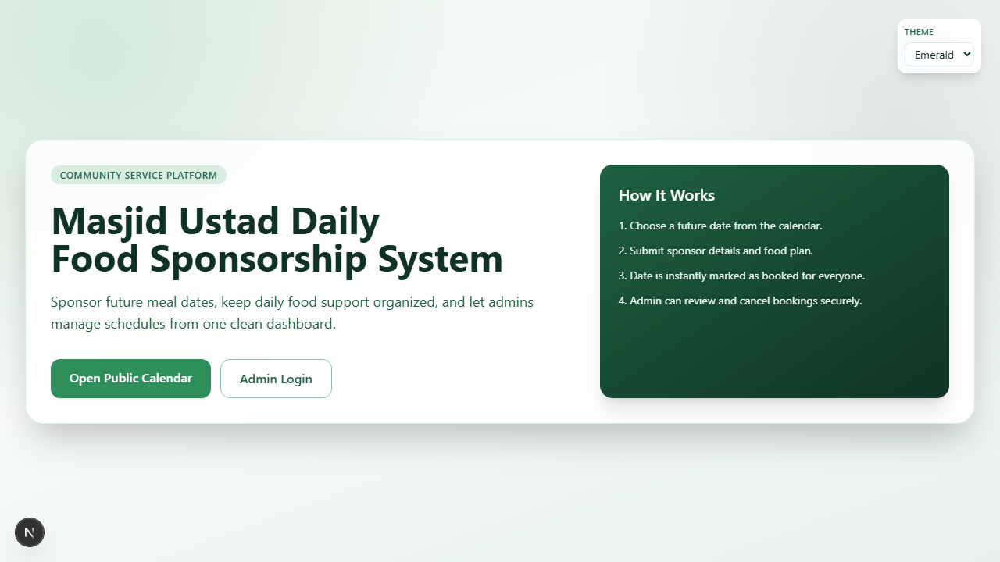
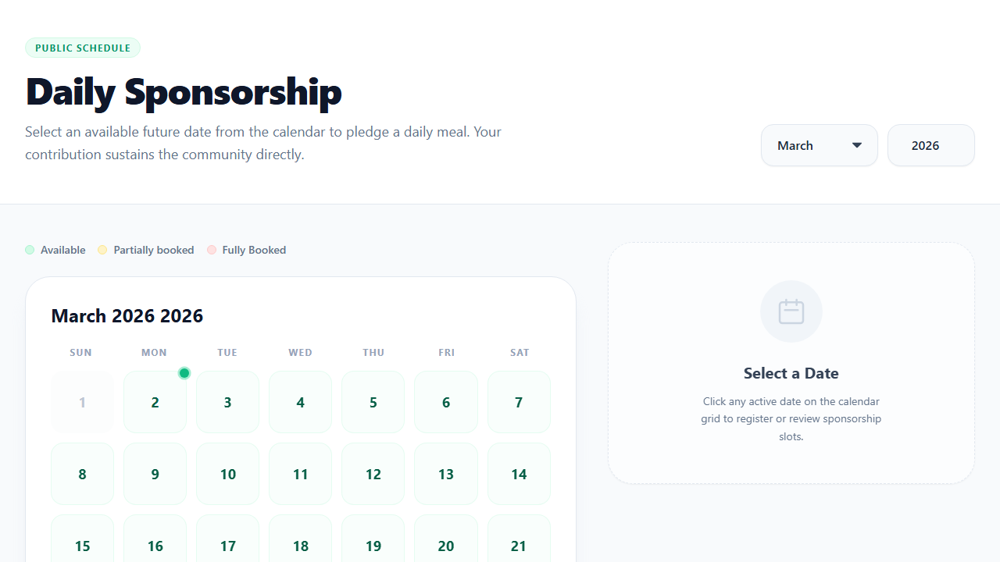
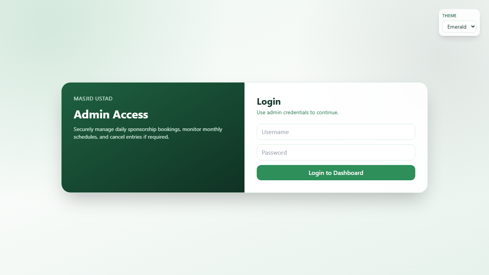

# Masjid Ustad Daily Food Sponsorship System

Full-stack Next.js application for managing daily meal sponsorships for Ustad with meal-slot booking, admin controls, and user-side cancellation/payment options.

## Live Demo

https://masjid-ustad-daily-food-sponsorship.vercel.app/
## database run only in local

## Screenshots


### Home


### Calendar


### Admin Login


### Admin Dashboard


## Tech Stack

- Next.js 15 (App Router)
- TypeScript
- Tailwind CSS
- JWT auth (`jose`)
- Password hashing (`bcryptjs`)
- Zod validation
- Local JSON storage (`data/local-db.json`)

## Core Features

- Sponsor registration
- Meal-slot booking by date:
  - Breakfast
  - Lunch
  - Dinner
- Same date supports different sponsors for different meal slots
- One sponsor per date + meal slot
- Public calendar with slot availability
- User-side booking cancellation flow:
  - Pay + QR then cancel
  - Skip and cancel
- Separate `Zekath for Ustad` QR option (independent of cancellation)
- Admin login with HTTP-only JWT cookie
- Admin dashboard to view and cancel bookings

## Storage

Data is stored in:

- `data/local-db.json`

This file is auto-created on first API call.

## Environment Variables

Copy env template:

```bash
cp .env.example .env
```

Set values:

```env
JWT_SECRET="1234567"
JWT_EXPIRES_IN="30m"
ADMIN_DEFAULT_USERNAME="admin"
ADMIN_DEFAULT_PASSWORD="admin12345"
NEXT_PUBLIC_DONATION_TEXT="Masjid Ustad donation"
NEXT_PUBLIC_ZAKAT_TEXT="Masjid Ustad zekath"
```

## Run Locally

```bash
npm install
npm run dev
```

App URLs:

- Home: `http://localhost:3000/`
- Calendar: `http://localhost:3000/calendar`
- Login: `http://localhost:3000/login`
- Dashboard: `http://localhost:3000/dashboard`

## API Endpoints

- `POST /api/sponsors`
- `POST /api/bookings`
- `GET /api/bookings?month=3&year=2026`
- `DELETE /api/bookings/:id` (public cancel from user flow)
- `POST /api/admin/login`
- `GET /api/admin/bookings?month=3&year=2026` (admin only)
- `DELETE /api/admin/bookings/:id` (admin only)

## Deployment

Use Vercel for full functionality (GitHub Pages is static-only and will not support `/api/*` routes).

1. Push repository to GitHub.
2. Import project in Vercel.
3. Add environment variables from `.env.example`.
4. Deploy.
